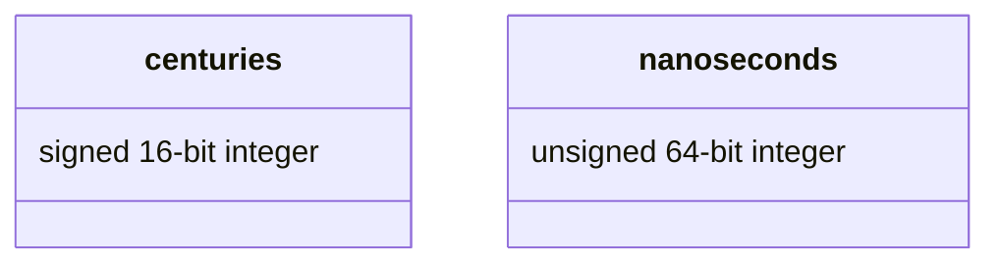
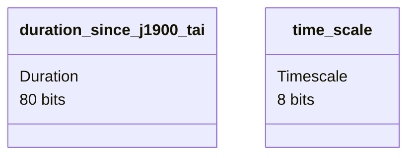

This sections explains the inner workings of epochs and durations in hifitime. This is not relevant to people who just want to use the library.

Hifitime provides several main constructs:

+ `Duration`: a positive or negative duration with nanosecond precision
+ `Epoch`: a datetime with the time scale used to initialize it [^1]
+ `TimeScale`: an enum storing the different time scales (or "time systems") supported by hifitime
+ `TimeSeries`: an iterable structure that yields epochs at a fixed interval between a starting and ending datetime

In addition to extensive unit and integration testing, Hifitime is formally verified for operations on epochs and durations using the [`Kani`](https://model-checking.github.io/kani/) model checking.

## Memory layout

### Duration

A packed structured is composed of two items and fits on 10 octets.

### Epoch

A packed structured is composed of two items and fits on 11 octets.

### Time scales

Time scaled are defined on a single octet (`u8`).

### Unit

Time units are defined on a single octet (`u8`).

## Requirements

Click on the requirement to see its description, verification method, and its children requirements. Note that the library has features in addition to those listed as requirements.

???+ success "1.0: Epochs shall maintain their accuracy for past and future dates"
    Astrodynamics require the state knowledge of celestial bodies to the highest accuracy possible. This data is stored in ephemerides, and those must be queried in the time scale they were generated in (Ephemeris Time).

    **Verification:** testing

    **Test plan:** Two epochs representing the same datetime but initialized in different formats (in seconds past J2000 or in Julian days) should indeed represent the same epoch with the same accuracy.

    ???+ success "1.1: Astronomy time scales shall be supported"
        Astronomy has its own set of time scales, as described in the [introduction](index.md).

        **Verification:** testing

        **Test plan:** Epochs may be initialized in different time scales and demonstrate that they represent different epochs with respect to the reference epoch.

        ??? success "1.1.1: Ephemeris Time shall be supported"
            Ephemeris Time has been the standard for astrodynamics data where the gravity of the Earth is irrelevant.
    
            **Verification:** testing
    
            **Test plan:** Ephemeris time shall match NAIF SPICE to machine precision.

        ??? success "1.1.2: Temps Atomique International shall be supported"
            TAI is the world clock as averaged by several atomic clocks around the world. UTC is defined as an offset from TAI to account for true universal time with respect to the stars. Without TAI support, UTC support would not be possible. Moreover, NTP is defined as an offset from J1900 TAI.
    
            **Verification:** testing
    
            **Test plan:** TAI demonstrates a purely monotonic clock.

    ???+ success "1.2: Human time shall be supported"
        Humans (mostly) live on Earth, where gravity is real and affects time.

        **Verification:** inspection

        **Test plan:** N/A

        ??? success "1.2.1: Universal Coordinated Time (UTC) shall be supported with leap seconds"
            UTC is the human time, and humans will be using this library. UTC adds leap seconds as announced by the IERS, and these shall also be supported.
    
            **Verification:** testing
    
            **Test plan:** UTC computations shall be cross checked against external sources.

        ??? success "1.2.2: Universal Time (UT or UT1) shall be supported"
            UT1 cannot be predicted and instead are announced by NASA and others, like on [JPL's website](https://eop2-external.jpl.nasa.gov/).
    
            **Verification:** testing
    
            **Test plan:** An Earth Orientation File can be loaded and a UT defined time can be converted to its TAI equivalent.

???+ success "2.0: Epochs shall be parsed and formatted using standardized formats"
    Several standards define how to parse date times.

    **Verification:** inspection

    **Test plan:** N/A

    ???+ success "2.1: RFC3339"
        The [RFC3339](https://www.rfc-editor.org/rfc/rfc3339) defines datetime objects with a fully qualified year, month, day, hour, minute, second, and optionally sub-seconds. It also supports either UTC time or a fixed offset from UTC defined in hours and minutes from UTC.

        **Verification:** testing

        **Test plan:** From a set of valid RFC3339 examples, the library should demonstrate correct parsing of these datetime objects. It should also demonstrate correct formatting of these dates into the RFC3339 and ensure no loss of precision from such operations

        ??? success "2.1.1: RFC3339 parsing with and without sub-seconds"
            Sub-second precision is important for many applications.
    
            **Verification:** testing
    
            **Test plan:** From a test bank of valid RFC3339 examples, ensure that some of these include sub-second data and that it can be correctly read.

        ??? success "2.1.2: RFC3339 parsing with and without offset"
            Computers typically serialize time with their own current offset to UTC.
    
            **Verification:** testing
    
            **Test plan:** The test bank of examples shall include datetime objects with and without UTC offsets.

        ??? success "2.1.3: Epochs shall be representable in RFC3339 with and without sub-seconds"
            If the epoch does not have a round number of seconds, then the formatting shall include the sub-seconds.
    
            **Verification:** testing
    
            **Test plan:** Epochs to demonstrate formatting with and without sub-seconds.

        ??? success "2.1.4: Epochs shall be representable in RFC3339 with UTC offsets"
            The UTC offset of the current computer shall be supported in the RFC3339 formatting/
    
            **Verification:** testing
    
            **Test plan:** Epochs shall be formatted without offsets with respect to UTC where applicable.

    ???+ success "2.2: Fully qualified date time ISO8601 representation"
        The [ISO8601](https://en.wikipedia.org/wiki/ISO_8601) format for date and time objects support many different formats and is commonly used.
        _Note:_ as a high precision date time library, hifitime cannot support date only representations.

        **Verification:** testing

        **Test plan:** The RFC3339 tests also implicitly cover the ISO8601 date time representations.

???+ success "3.0: Safety critical systems shall be supported"
    Safety critical systems such as spacecraft or generic embedded devices often require date time libraries. Too often, custom implementations lead to errors that may cause mission failures.

    **Verification:** inspection

    **Test plan:** N/A

    ???+ success "3.1: Computations shall be free of runtime errors"
        Any function or computation that may fail shall ensure at compile time that the user is aware of a failure before attempting to use the result.
    
        **Verification:** inspection
    
        **Test plan:** All functions that may fail shall return a `Result` type in Rust.

    ???+ success "3.2: Memory allocations shall be avoided"
        Embedded systems are often very memory constrained. [Memory allocations](https://quality.nyxspace.com/guidelines/embedded/#memory-and-stack-size-management) may cause fragmentation of the memory which may be catastrophic to the rest of the program.
    
        **Verification:** testing
    
        **Test plan:** Functions that require memory allocations shall be behind a compile-time feature preventing their compilation for embedded devices. The test suite shall also test on embedded platforms.

    ???+ success "3.3: Floating point operations shall be limited"
        Embedded devices may not all be equipped with a floating point unit dedicated to floating point operations. Hence, where possible, prefer integer based operations instead of floating point operations.
    
        **Verification:** inspection
    
        **Test plan:** N/A
