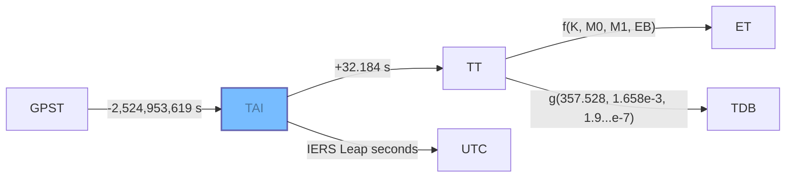

Hifitime is a precision-oriented time management library available in [Rust](rust.md) and [Python](python.md) tailored for scientific applications and programs that demand high accuracy in time computations. Hifitime guarantees exactly one nanosecond of precision in all epochs and duration computations for 65,536 years.

Hifitime is trusted by leading scientific and aerospace organizations for critical time computation tasks in their pioneering projects and research, including [**Amazon Web Services**](https://aws.amazon.com/blogs/opensource/how-open-source-projects-are-using-kani-to-write-better-software-in-rust/), the [**Murchison Widefield Array**](https://www.mwatelescope.org/) radio telescope, [**Rocketlab USA**](https://www.rocketlabusa.com), and [many others](https://pepy.tech/project/hifitime). This widespread adoption underscores Hifitime's role as a foundational tool in the field of high-precision time management.

In addition to extensive unit and integration testing, the Rust code of Hifitime is [formally verified using the Kani model checker](https://model-checking.github.io/kani-verifier-blog/2023/03/31/how-kani-helped-find-bugs-in-hifitime.html).

## Installation

=== "Python"

    ``` sh
    pip install hifitime
    ```

=== "Rust"

    ``` sh
    cargo add hifitime
    ```


## Time scales

Refer to the [documentation](https://docs.rs/hifitime/latest/hifitime/enum.TimeScale.html) for the exhaustive list of time scales supported in Hifitime.




Time scales (or "time systems" in the ESA lingo) are a standard for measuring the passing of time. Humans typically follow Coordinated Universal Time (UTC) which is defined as the mean solar time at 0° longitude, with some longitude and geopolitical offset (time zones). We also abide by the concept that all seconds are of equal durations, i.e., the tick rate of a stopwatch does not change throughout days or years: the conflicts with UTC because the Earth does not complete a full rotation in an exact number of seconds, and the time it takes to complete a full rotation cannot be predicted exactly.

The UT1 time scale measures time with respect to the stars: several scientific organizations publish the true UT1 time as part of their daily publication of the Earth Orientation Parameters (EOP). To simplify everyone's life, UTC still assumes that the Earth completes one full rotation in exactly 24 hours, or 86,400 seconds.

The Temps Atomique International (TAI) time scale is an average measure of atomic clocks throughout the world: it is the reference for the duration of a single second. UTC is an offset from TAI such that UTC stays within one second of UT1. These corrections are called _leap seconds_, and are announced by the International Earth Rotation and Reference Systems Service (IERS) at least six months in advance. The following plot shows how UTC deviates from so-called "glitch-free" time scales, which don't account for leap seconds.

--8<-- "includes/time-scale-deviation.html"

Relativity affects time: gravity wells warp the spacetime continuum by slowing down the passing of time. For example, a single second is slower on Earth than it is in the vacuum between Mars and Jupiter. Astronomy and astrodynamics applications must account for this by defining a new time scale. The Dynamic Barycentric Time (TDB) time scale includes a correction to the duration of a second compared to TAI to remove the effects of the gravity of Earth on the passing of time. Application-specific time scales also exist, like Global Positioning System (GPST), Galileo time scale (GST), and many more.

--8<-- "includes/time-scale-deviation-no-utc.html"

Finally, astronomers don't forget the past. This is best explained by IAU SOFA:

!!! quote
    Calculations in any scientific discipline may involve precise time, but what sets astronomy apart is the number and variety of time scales that have to be used.

    There are several reasons for this: astronomers must continue to deal with the very phenomena that lie behind obsolete time scales, in particular the rotation of the Earth and the motions of the planets; as new time scales have been introduced, continuity with the past has been preserved, leaving in the various astronomical time scales a fossil record of former offsets and rates; and in astronomical applications the physical context of the “clock” matters, whether it is on Earth, moving or stationary, or on a spacecraft.
    
    -- "SOFA Time Scales and Calendar Tools", Document version 1.61, section 3.1

As an example, Hifitime supports both the recent TDB time scale and the older Ephemeris Time (ET) time scale. Here is how they vary with respect to each other.

--8<-- "includes/time-scale-deviation-tdb-et.html"


## Comparison with SPICE

1. Hifitime and SPICE perform the same computation for Ephemeris Time, i.e. the error between hifitime and SPICE in Ephemeris Time is constrained only by the precision of the SPICE representation.
1. SPICE stores epochs in a single double-precision value (64-bit floats). This leads to considerable loss in precision when initializing epochs that are far from the 01 JAN 2000 ET.
1. SPICE only supports the Ephemeris Time and UTC time scales, whereas hifitime also supports several other commonly used scales.
1. Hifitime can also trivially be used in embedded systems, even for UTC conversions, without the need of an external file. SPICE requires parsing of the text file of leap seconds (e.g. `naif00012.tls`) prior to converting to/from a UTC datetime.
1. Hifitime supports initializing and formatting epochs in RFC3339 and ISO8601 formats, in addition to the NAIF formats starting with `MJD`, `SEC`, or `JD`.
1. SPICE incorrectly assumes that the difference between TAI and UTC is _nine_ seconds prior to the first leap second of 1972. Hifitime uses the SOFA leap seconds when requested.
1. SPICE uses an approximation of ET instead of TDB which does not include the small perturbations.
1. Hifitime stores its base epoch in TAI whereas NAIF uses an approximation of ET.

!!! quote
    Leap seconds pose tricky problems for software writers, and consequently there are concerns that these events put safety-critical systems at risk. The correct solution is for designers to base such systems on TAI or some other glitch-free time scale, not UTC, but this option is often overlooked until it is too late.
    
    -- "SOFA Time Scales and Calendar Tools", Document version 1.61, section 3.5.1

## Comparison with SOFA

1. SOFA stores datetimes as a tuple of two double-precision floats (on 64-bits each). Instead, hifitime stores datetimes as a duration since J1900 TAI, and a duration is stored as a tuple of a signed 16-bit integer and an unsigned 64-bit integer.
1. SOFA supports the TCB and TCG time scales, which hifitime does not support.
1. SOFA supports the unpredictable `UT1` time scale, which hifitime does not support.


[^1]: Note that hifitime does not support date-agnostic epochs or time-agnostic epochs, only a combination of both.

--8<-- "includes/Abbreviations.md"