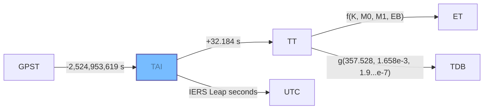

Hifitime is a precision-oriented time management library available in [Rust](rust.md) and [Python](python.md) tailored for scientific applications and programs that demand high accuracy in time computations. Hifitime guarantees exactly one nanosecond of precision in all epochs and duration computations for 65,536 years.

Hifitime is trusted by leading scientific and aerospace organizations for critical time computation tasks in their pioneering projects and research, including [**Amazon Web Services**](https://aws.amazon.com/blogs/opensource/how-open-source-projects-are-using-kani-to-write-better-software-in-rust/), the [**Murchison Widefield Array**](https://www.mwatelescope.org/) radio telescope, [**Rocketlab USA**](https://www.rocketlabusa.com), and [many others](https://pepy.tech/project/hifitime). This widespread adoption underscores Hifitime's role as a foundational tool in the field of high-precision time management.

In addition to extensive unit and integration testing, the Rust code of Hifitime is [formally verified using the Kani model checker](https://model-checking.github.io/kani-verifier-blog/2023/03/31/how-kani-helped-find-bugs-in-hifitime.html).

## Installation

=== "Python"

    ``` sh
    pip install hifitime
    ```

=== "Rust"

    ``` sh
    cargo add hifitime
    ```


## Time scales

Refer to the [documentation](https://docs.rs/hifitime/latest/hifitime/enum.TimeScale.html) for the exhaustive list of time scales supported in Hifitime.




Time scales, or "time systems" as referred to by the European Space Agency, are standardized methods for measuring the passage of time. They are essential for ensuring consistency and precision in various scientific and engineering contexts.

Humans typically follow Coordinated Universal Time (UTC), which is based on the mean solar time at the prime meridian (0° longitude). Time zones are a longitude and geopolitical construct that apply a fixed offset to UTC such that noon is roughly when the Sun is at its highest point in the sky in a given day. UTC operates on the principle that all seconds are of equal duration, maintaining a constant tick rate over days and years. However, this conflicts with the Earth's rotation, which does not complete in an exact number of seconds and varies unpredictably.

The UT1 time scale measures time relative to the stars, reflecting the Earth's actual rotation. Scientific organizations publish UT1 as part of their daily Earth Orientation Parameters (EOP) updates. Despite these complexities, UTC simplifies matters by assuming a constant 24-hour day, equivalent to 86,400 seconds.

Temps Atomique International (TAI) is a time scale based on the average of atomic clocks worldwide, providing a precise standard for the duration of a second. UTC is an offset from TAI designed to keep it within one second of UT1. This alignment is achieved through leap seconds, which are adjustments announced by the International Earth Rotation and Reference Systems Service (IERS) at least six months in advance.

The interplay between these time scales illustrates how UTC deviates from "glitch-free" systems that do not incorporate leap seconds, highlighting the ongoing challenge of synchronizing human timekeeping with astronomical realities.

--8<-- "includes/time-scale-deviation.html"

!!! quote
    Leap seconds pose tricky problems for software writers, and consequently there are concerns that these events put safety-critical systems at risk. The correct solution is for designers to base such systems on TAI or some other glitch-free time scale, not UTC, but this option is often overlooked until it is too late.
    
    -- "SOFA Time Scales and Calendar Tools", Document version 1.61, section 3.5.1

Gravity wells distort the spacetime continuum, slowing down the passage of time. For instance, a second on Earth is slightly slower than a second in the vacuum between Mars and Jupiter. To address these variations, especially in astronomy and astrodynamics, specialized time scales are developed.

Dynamic Barycentric Time (TDB) is one such time scale. It includes corrections to the duration of a second relative to TAI, compensating for the gravitational effects of Earth on time. In addition to TDB, there are application-specific time scales tailored to particular systems. For example, the Global Positioning System (GPST) and the Galileo time scale (GST) are designed to meet the unique requirements of their respective satellite navigation systems. 


--8<-- "includes/time-scale-deviation-no-utc.html"

Finally, astronomers don't forget the past. This is best explained by IAU SOFA:

!!! quote
    Calculations in any scientific discipline may involve precise time, but what sets astronomy apart is the number and variety of time scales that have to be used.

    There are several reasons for this: astronomers must continue to deal with the very phenomena that lie behind obsolete time scales, in particular the rotation of the Earth and the motions of the planets; as new time scales have been introduced, continuity with the past has been preserved, leaving in the various astronomical time scales a fossil record of former offsets and rates; and in astronomical applications the physical context of the “clock” matters, whether it is on Earth, moving or stationary, or on a spacecraft.
    
    -- "SOFA Time Scales and Calendar Tools", Document version 1.61, section 3.1

As an example, Hifitime supports both the recent TDB time scale and the older Ephemeris Time (ET) time scale. Here is how they vary with respect to each other.

--8<-- "includes/time-scale-deviation-tdb-et.html"


## Comparison with SPICE

1. Both Hifitime and SPICE perform calculations for Ephemeris Time, with discrepancies limited only by SPICE's precision.
2. SPICE stores epochs using a single double-precision value (64-bit floats), leading to significant precision loss for epochs far from 01 January 2000 ET.
3. While SPICE supports only Ephemeris Time and UTC, Hifitime handles several additional commonly used time scales.
4. Hifitime is easily deployable in embedded systems, even for UTC conversions, without requiring external files. In contrast, SPICE needs to parse a leap seconds file (e.g., `naif00012.tls`) for UTC conversions.
5. Hifitime supports initializing and formatting epochs in RFC3339 and ISO8601 formats, as well as NAIF formats like `MJD`, `SEC`, or `JD`.
6. SPICE inaccurately assumes a nine-second difference between TAI and UTC before the first leap second in 1972. Hifitime uses SOFA leap seconds when requested.
7. SPICE approximates ET instead of using TDB, omitting minor perturbations.

## Comparison with SOFA

SOFA stores datetimes as a pair of double-precision floats (64 bits each), whereas Hifitime represents them as a duration since the time scale's reference epoch, where the duration is a tuple of a signed 16-bit integer and an unsigned 64-bit integer.

--8<-- "includes/Abbreviations.md"