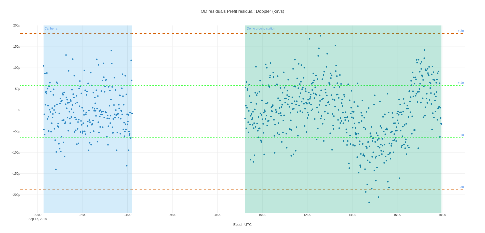

---
hide:
  - navigation
  - toc
---


# Nyx Space: Revolutionizing Flight Dynamics {: .tagline}

<p class="subtagline">Blazing fast open-source tools from mission concept to operations, analysis, and automation</p>

<!-- !!! tip inline "Get started for free"

    Add Nyx to your current Python environment:
    ```sh
    pip install nyx_space
    ```

    Add Nyx to your [Rust :material-language-rust:](https://rust-lang.org) project:
    ```sh
    cargo add nyx_space
    ```

    [**Read the documentation** :material-file-document-multiple-outline:](/nyxspace/showcase/)


    [**Browse the source code** :material-github:](https://github.com/nyx-space/nyx)

    [**Learn about companion projects** :material-compass-rose:](/hifitime/intro)


<script src="https://asciinema.org/a/590749.js" id="asciicast-590749" async data-autoplay="false" data-theme="solarized-dark" data-rows="20"></script> -->

<main class="landing">
    
<!-- <section class="card-container">
    <article class="card">
        <h2>Empowering flight dynamics engineers</h2>
        <h4>Powerful, open-source tools for mission design and analysis</h4>
        <p>As a flight dynamics engineer, you need to plan maneuvers, analyze spacecraft trajectories, and quickly turn around orbit determination solutions. Most options are proprietary, clunky, expensive, and slow.
        </p>
        <p>
        <span class="emph">Nyx is different.</span>
        <ul>
        <li>Trajectory planning - Targeting and optimization, low thrust or not</li>
        <li>Orbit determination - Gauss Markov noise models, and state-of-the-art autodiff for all orbital dynamics</li>
        <li>Interoperable - uses CCSDS standards and open formats (parquet, yaml)</li>
        <li>Free and open-source - no expensive licenses</li>
        <li>Analysis - plots are finally interactive</li>
        </ul>
        Plotting some residuals (dots dots dots!)
        
        </p>
    </article>
    <article class="card">
        <h2>Built for speed, automation and scalability</h2>
        <h4>Simulate more, faster, from your desktop to the cloud</h4>
        <p>Nyx was built from the ground up to leverage advancements in computer science for space mission design. Our focus on performance, automation, and cloud/HPC-readiness provide insights for any operational scenario.</p>
        <p>
        <span class="emph">Unlock the future.</span>
        <ul>
        <li>Simulate and analyze thousands spacecraft in high-fidelity in mere seconds on a standard desktop</li>
        <li>Automate repetitive tasks like report generation, data processing, and off-nominal simulation</li>
        <li>Python API for easy integration into your automated pipelines and workflows</li>
        <li>Deploy across architectures from a laptop to the cloud for massive scaling</li>
        </ul>
        </p>
        <p>
        Simulation of ten thousand spacecraft in high-fidelity in 90 seconds on a standard desktop (gravity of Earth, Moon, Sun, and Earth spherical harmonics of 12x12)
        <div class="chart">
            <div class="bar nyx" style="width: 45%">
                <div>Nyx: 90 seconds</div>
            </div>
            <div class="bar gmat" style="width: 85%">
                <div>GMAT: > 1 hour</div>
            </div>
            <div class="bar ansys" style="width: 100%">
                <div>ANSYS STK: > 1 hour + $$$</div>
            </div>
        </div>
        </p>
    </article>
    <article class="card">
        <h2>Reliable, tested and documented</h2>
        <h4>Mission-critical reliability through transparency and rigor</h4>
        <p>Nyx provides a robust astrodynamics library tested against real-world scenarios and well documented to support your mission from planning to operations. You can also discuss solutions directly <a href="https://github.com/nyx-space/nyx/discussions">with the community</a>.</p>
        <p>
        <span class="emph">No more obsolete documentation</span>
        <ul>
        <li>Documentation uses the proven Diátaxis method to orient users</li>
        <li>Hundreds of tests validate calculations, methods and outputs</li>
        <li>Approachable syntax and interactive visuals foster understanding</li>
        <li>Lower risk through transparent verification and validation</li>
        </ul>
        
        </p>
    </article>
</section> -->
    
<section class="card-container">
    <!-- Nyx Card -->
    <article class="card">
        <div class="card-content">
            <h2 style="margin: 0">Nyx: Comprehensive Spaceflight Dynamics</h2>
            <h4>Empowering flight dynamics engineers</h4>
            <p>Nyx offers an innovative approach to spaceflight dynamics: free and open-source tools available directly in Python and Rust, for mission planning, trajectory optimization, advanced orbit determination, and all via interoperable formats (CCSDS OEM and SPICE files). Embrace the power of open-source and empowering flight dynamics engineers.</p>
            <a href="/nyxspace/showcase/" class="md-button md-button--primary">Learn more</a>
            <a href="/nyxspace/MathSpec/" class="md-button">Math Spec
            <span class="twemoji"><svg xmlns="http://www.w3.org/2000/svg" viewBox="0 0 24 24"><path d="M20 19.88V22l-1.8-1.17-4.79-9c.66-.21 1.26-.55 1.78-1L20 19.88M15 7a3 3 0 0 1-3 3h-.44L5.8 20.83 4 22v-2.12L9.79 9c-1.1-1.23-1-3.13.24-4.24C10.57 4.28 11.27 4 12 4V2a1 1 0 0 1 1 1v1.18c1.2.42 2 1.55 2 2.82m-2 0a1 1 0 0 0-1-1 1 1 0 0 0-1 1 1 1 0 0 0 1 1 1 1 0 0 0 1-1Z"></path></svg></span></a>
            <a href="https://rustdoc.nyxspace.com/" class="md-button" target="_blank">
            Rust API <span class="twemoji"><svg xmlns="http://www.w3.org/2000/svg" viewBox="0 0 24 24"><path d="m21.9 11.7-.9-.5V11l.7-.7c.1-.1.1-.3 0-.4l-.1-.1-.9-.3c0-.1 0-.2-.1-.2l.6-.8c.1-.1.1-.3-.1-.4 0 0-.1 0-.1-.1l-1-.2c0-.1-.1-.1-.1-.2l.4-.9v-.3c-.1-.1-.2-.1-.3-.1h-1s0-.1-.1-.1l.2-1c0-.2-.1-.3-.2-.3h-.1l-1 .2c0-.1-.1-.1-.2-.2v-1c0-.2-.1-.3-.3-.3h-.1l-.9.4h-.1L16 3c0-.2-.2-.3-.3-.2h-.1l-.8.6c-.1 0-.2 0-.2-.1l-.3-.9c-.1-.1-.2-.2-.4-.2 0 0-.1 0-.1.1L13 3h-.2l-.5-.8c-.1-.2-.3-.2-.5-.2l-.1.1-.5.9H11l-.7-.7c-.1-.1-.3-.1-.4 0l-.1.1-.3.9c-.1 0-.2 0-.2.1l-.8-.6c-.2-.1-.4-.1-.5.1V3l-.2 1s-.1 0-.2.1l-.9-.4c-.1-.1-.3 0-.4.1v1.1c0 .1-.1.1-.1.2l-1-.2c-.2-.1-.3 0-.3.2v.1l.2 1c-.1 0-.1.1-.2.1h-1c-.2 0-.3.1-.3.3v.1l.4.9v.2L3 8c-.2 0-.3.2-.3.3v.1l.6.8c0 .1 0 .2-.1.2l-.8.4c-.1.1-.2.2-.2.4 0 0 0 .1.1.1l.7.7v.2l-.8.5c-.2.1-.2.3-.2.4l.1.1.9.6v.2l-.7.7c-.1.1-.1.3 0 .4l.1.1.9.3c0 .1 0 .2.1.2l-.6.8c-.1.1-.1.3.1.4 0 0 .1 0 .1.1l1 .2c0 .1.1.1.1.2l-.4.9c-.1.1 0 .3.1.4h1.1c.1 0 .1.1.2.1l-.2 1c0 .2.1.3.2.3h.1l1-.2c0 .1.1.1.2.2v1c0 .2.1.3.3.3h.1l.9-.4h.1l.2 1c0 .2.2.3.3.2h.1l.8-.6c.1 0 .2 0 .2.1l.3.9c.1.1.2.2.4.2 0 0 .1 0 .1-.1l.8-.7h.2l.5.8c.1.1.3.2.4.1l.1-.1.5-.8h.2l.7.7c.1.1.3.1.4 0l.1-.1.3-.9c.1 0 .2 0 .2-.1l.8.6c.1.1.3.1.4-.1 0 0 0-.1.1-.1l.2-1c.1 0 .1-.1.2-.1l.9.4c.1.1.3 0 .4-.1v-1.1l.2-.2 1 .2c.2 0 .3-.1.3-.2v-.1l-.2-1 .2-.2h1c.2 0 .3-.1.3-.3v-.1l-.4-.9c0-.1.1-.1.1-.2l1-.2c.2 0 .3-.2.2-.3v-.1l-.6-.8.1-.2.9-.3c.1-.1.2-.2.2-.4 0 0 0-.1-.1-.1L21 13v-.2l.8-.5c.2-.1.2-.3.1-.6 0 .1 0 .1 0 0m-5.7 7c-.3-.1-.5-.4-.5-.7.1-.3.4-.5.7-.5.3.1.5.4.5.7 0 .4-.3.6-.7.5m-.2-1.9c-.3-.1-.6.1-.6.4l-.4 1.4c-.9.4-1.9.6-3 .6s-2.1-.2-3.1-.7l-.3-1.4c-.1-.3-.3-.5-.6-.4l-1.2.3c-.2-.2-.4-.5-.6-.7h6c.1 0 .1 0 .1-.1v-2.1c0-.1 0-.1-.1-.1h-1.7v-1.3h1.9c.2 0 .9 0 1.2 1 .1.3.2 1.3.4 1.6.1.3.6 1 1.1 1h3.1c-.2.3-.4.5-.7.8l-1.5-.3m-8.3 1.9c-.3.1-.6-.1-.7-.5-.1-.3.1-.6.5-.7s.6.1.7.5c0 .3-.2.6-.5.7M5.4 9.5c.1.3 0 .7-.3.8-.3.1-.7 0-.8-.3-.1-.3 0-.7.3-.8.4-.1.7 0 .8.3m-.7 1.6 1.3-.5c.3-.1.4-.4.3-.7L6 9.3h1V14H5c-.3-1-.4-1.9-.3-2.9m5.6-.4V9.3h2.5c.1 0 .9.1.9.7 0 .5-.6.7-1.1.7h-2.3m9 1.2v.5h-.8c-.1 0-.1 0-.1.1v.3c0 .8-.5 1-.9 1s-.8-.2-.9-.4c-.2-1.3-.6-1.5-1.2-2 .7-.5 1.5-1.2 1.5-2.1 0-1-.7-1.6-1.1-1.9-.7-.4-1.4-.5-1.6-.5H6.6c1.1-1.2 2.5-2 4.1-2.3l.9 1c.2.2.5.2.8 0l1-1c2.1.4 3.9 1.7 5 3.6l-.7 1.6c-.1.3 0 .6.3.7l1.3.6v.8m-7.7-8c.2-.2.6-.2.8 0 .2.2.2.6 0 .8-.3.3-.6.3-.9 0-.2-.2-.1-.5.1-.8m6.9 5.6c.1-.3.5-.4.8-.3.3.1.4.5.3.8-.1.3-.5.4-.8.3-.3-.1-.4-.5-.3-.8Z"></path></svg></span></a>
        </div>
    </article>
    <!-- Hifitime Card -->
    <article class="card">
        <div class="card-content">
            <h2 style="margin: 0">Hifitime: Precision Time Management</h2>
            <h4>Advanced library for time systems conversions</h4>
            <p>Hifitime stands out with its precise time management capabilities, essential for accurate space mission planning and execution. It facilitates seamless conversion between various time systems, ensuring synchronization and accuracy in every mission phase. Discover the efficiency of time management with formal verification.</p>
            <a href="/hifitime/intro/" class="md-button md-button--primary">Learn more</a>
            <a href="/hifitime/python/" class="md-button">Python docs
            <span class="twemoji"><svg xmlns="http://www.w3.org/2000/svg" viewBox="0 0 24 24"><path d="M19.14 7.5A2.86 2.86 0 0 1 22 10.36v3.78A2.86 2.86 0 0 1 19.14 17H12c0 .39.32.96.71.96H17v1.68a2.86 2.86 0 0 1-2.86 2.86H9.86A2.86 2.86 0 0 1 7 19.64v-3.75a2.85 2.85 0 0 1 2.86-2.85h5.25a2.85 2.85 0 0 0 2.85-2.86V7.5h1.18m-4.28 11.79c-.4 0-.72.3-.72.89 0 .59.32.71.72.71a.71.71 0 0 0 .71-.71c0-.59-.32-.89-.71-.89m-10-1.79A2.86 2.86 0 0 1 2 14.64v-3.78A2.86 2.86 0 0 1 4.86 8H12c0-.39-.32-.96-.71-.96H7V5.36A2.86 2.86 0 0 1 9.86 2.5h4.28A2.86 2.86 0 0 1 17 5.36v3.75a2.85 2.85 0 0 1-2.86 2.85H8.89a2.85 2.85 0 0 0-2.85 2.86v2.68H4.86M9.14 5.71c.4 0 .72-.3.72-.89 0-.59-.32-.71-.72-.71-.39 0-.71.12-.71.71s.32.89.71.89Z"></path></svg></span>
            </a>
            <a href="/hifitime/rust/" class="md-button">
            Rust docs <span class="twemoji"><svg xmlns="http://www.w3.org/2000/svg" viewBox="0 0 24 24"><path d="m21.9 11.7-.9-.5V11l.7-.7c.1-.1.1-.3 0-.4l-.1-.1-.9-.3c0-.1 0-.2-.1-.2l.6-.8c.1-.1.1-.3-.1-.4 0 0-.1 0-.1-.1l-1-.2c0-.1-.1-.1-.1-.2l.4-.9v-.3c-.1-.1-.2-.1-.3-.1h-1s0-.1-.1-.1l.2-1c0-.2-.1-.3-.2-.3h-.1l-1 .2c0-.1-.1-.1-.2-.2v-1c0-.2-.1-.3-.3-.3h-.1l-.9.4h-.1L16 3c0-.2-.2-.3-.3-.2h-.1l-.8.6c-.1 0-.2 0-.2-.1l-.3-.9c-.1-.1-.2-.2-.4-.2 0 0-.1 0-.1.1L13 3h-.2l-.5-.8c-.1-.2-.3-.2-.5-.2l-.1.1-.5.9H11l-.7-.7c-.1-.1-.3-.1-.4 0l-.1.1-.3.9c-.1 0-.2 0-.2.1l-.8-.6c-.2-.1-.4-.1-.5.1V3l-.2 1s-.1 0-.2.1l-.9-.4c-.1-.1-.3 0-.4.1v1.1c0 .1-.1.1-.1.2l-1-.2c-.2-.1-.3 0-.3.2v.1l.2 1c-.1 0-.1.1-.2.1h-1c-.2 0-.3.1-.3.3v.1l.4.9v.2L3 8c-.2 0-.3.2-.3.3v.1l.6.8c0 .1 0 .2-.1.2l-.8.4c-.1.1-.2.2-.2.4 0 0 0 .1.1.1l.7.7v.2l-.8.5c-.2.1-.2.3-.2.4l.1.1.9.6v.2l-.7.7c-.1.1-.1.3 0 .4l.1.1.9.3c0 .1 0 .2.1.2l-.6.8c-.1.1-.1.3.1.4 0 0 .1 0 .1.1l1 .2c0 .1.1.1.1.2l-.4.9c-.1.1 0 .3.1.4h1.1c.1 0 .1.1.2.1l-.2 1c0 .2.1.3.2.3h.1l1-.2c0 .1.1.1.2.2v1c0 .2.1.3.3.3h.1l.9-.4h.1l.2 1c0 .2.2.3.3.2h.1l.8-.6c.1 0 .2 0 .2.1l.3.9c.1.1.2.2.4.2 0 0 .1 0 .1-.1l.8-.7h.2l.5.8c.1.1.3.2.4.1l.1-.1.5-.8h.2l.7.7c.1.1.3.1.4 0l.1-.1.3-.9c.1 0 .2 0 .2-.1l.8.6c.1.1.3.1.4-.1 0 0 0-.1.1-.1l.2-1c.1 0 .1-.1.2-.1l.9.4c.1.1.3 0 .4-.1v-1.1l.2-.2 1 .2c.2 0 .3-.1.3-.2v-.1l-.2-1 .2-.2h1c.2 0 .3-.1.3-.3v-.1l-.4-.9c0-.1.1-.1.1-.2l1-.2c.2 0 .3-.2.2-.3v-.1l-.6-.8.1-.2.9-.3c.1-.1.2-.2.2-.4 0 0 0-.1-.1-.1L21 13v-.2l.8-.5c.2-.1.2-.3.1-.6 0 .1 0 .1 0 0m-5.7 7c-.3-.1-.5-.4-.5-.7.1-.3.4-.5.7-.5.3.1.5.4.5.7 0 .4-.3.6-.7.5m-.2-1.9c-.3-.1-.6.1-.6.4l-.4 1.4c-.9.4-1.9.6-3 .6s-2.1-.2-3.1-.7l-.3-1.4c-.1-.3-.3-.5-.6-.4l-1.2.3c-.2-.2-.4-.5-.6-.7h6c.1 0 .1 0 .1-.1v-2.1c0-.1 0-.1-.1-.1h-1.7v-1.3h1.9c.2 0 .9 0 1.2 1 .1.3.2 1.3.4 1.6.1.3.6 1 1.1 1h3.1c-.2.3-.4.5-.7.8l-1.5-.3m-8.3 1.9c-.3.1-.6-.1-.7-.5-.1-.3.1-.6.5-.7s.6.1.7.5c0 .3-.2.6-.5.7M5.4 9.5c.1.3 0 .7-.3.8-.3.1-.7 0-.8-.3-.1-.3 0-.7.3-.8.4-.1.7 0 .8.3m-.7 1.6 1.3-.5c.3-.1.4-.4.3-.7L6 9.3h1V14H5c-.3-1-.4-1.9-.3-2.9m5.6-.4V9.3h2.5c.1 0 .9.1.9.7 0 .5-.6.7-1.1.7h-2.3m9 1.2v.5h-.8c-.1 0-.1 0-.1.1v.3c0 .8-.5 1-.9 1s-.8-.2-.9-.4c-.2-1.3-.6-1.5-1.2-2 .7-.5 1.5-1.2 1.5-2.1 0-1-.7-1.6-1.1-1.9-.7-.4-1.4-.5-1.6-.5H6.6c1.1-1.2 2.5-2 4.1-2.3l.9 1c.2.2.5.2.8 0l1-1c2.1.4 3.9 1.7 5 3.6l-.7 1.6c-.1.3 0 .6.3.7l1.3.6v.8m-7.7-8c.2-.2.6-.2.8 0 .2.2.2.6 0 .8-.3.3-.6.3-.9 0-.2-.2-.1-.5.1-.8m6.9 5.6c.1-.3.5-.4.8-.3.3.1.4.5.3.8-.1.3-.5.4-.8.3-.3-.1-.4-.5-.3-.8Z"></path></svg></span></a>
        </div>
    </article>
    <!-- ANISE Card -->
    <article class="card">
        <div class="card-content">
            <h2 style="margin: 0">ANISE: Redefining Space Mission Analysis</h2>
            <h4>Modern rewrite of NASA's SPICE toolkit</h4>
            <p>ANISE revolutionizes space mission analysis with its modern take on NASA's SPICE toolkit. Bringing together formal verification and cutting-edge technology, it offers unparalleled accuracy and reliability for mission analysis and planning. Experience the next generation of space exploration tools with ANISE.</p>
            <a href="/anise/intro/" class="md-button md-button--primary">Learn more</a>
        </div>
    </article>
    <!-- Contact -->
    <article class="card">
        <div class="card-content">
            <h2 style="margin: 0">Trusted by Industry Leaders</h2>
            <h4>See who's already benefiting from our tools</h4>
            <p>Our tools are trusted and actively used by leading companies in the aerospace and technology sectors. Their commitment to using Nyx, Hifitime, and ANISE is a testament to the reliability, efficiency, and advanced capabilities of our software.</p>
            <ul>
                <li>Amazon Web Services</li>
                <li>Rocketlab USA</li>
                <li>Murchison Widefield Array</li>
                <li>Firefly Space</li>
                <li>Advanced Space LLC</li>
            </ul>
            <a href="https://7ug5imdtt8v.typeform.com/to/neFvVW3p" class="md-button md-button--primary" target="_blank">Contact Us</a>
        </div>
    </article>
</section>


</main>

</div>
