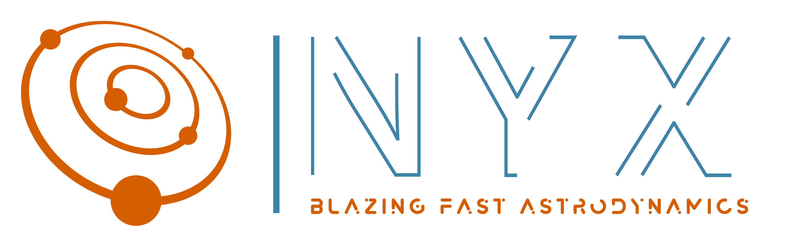

{: .center }

Blazing fast high-fidelity astrodynamics for <b class="emph">Monte Carlo</b> analyzes of <b class="emph">constellations</b>, <b class="emph">interplanetary</b> missions, and deep space <b class="emph">orbit determination</b>

    <a class="md-button md-button--primary" href="/user_guide/start/"><svg xmlns="http://www.w3.org/2000/svg" viewBox="0 0 24 24"><path d="M13.13 22.19l-1.63-3.83c1.57-.58 3.04-1.36 4.4-2.27l-2.77 6.1M5.64 12.5l-3.83-1.63 6.1-2.77C7 9.46 6.22 10.93 5.64 12.5M19.22 4c.28 0 .53 0 .74.05.17 1.39-.02 4.25-3.3 7.53-1.7 1.71-3.73 3.02-6.01 3.89l-2.15-2.1c.92-2.31 2.23-4.34 3.92-6.03C15.18 4.58 17.64 4 19.22 4m0-2c-1.98 0-4.98.69-8.22 3.93-2.19 2.19-3.5 4.6-4.35 6.71-.28.75-.09 1.57.46 2.13l2.13 2.12c.38.38.89.61 1.42.61.23 0 .47-.06.7-.15A19.1 19.1 0 0018.07 13c5.66-5.66 3.54-10.61 3.54-10.61S20.7 2 19.22 2m-4.68 7.46c-.78-.78-.78-2.05 0-2.83s2.05-.78 2.83 0c.77.78.78 2.05 0 2.83-.78.78-2.05.78-2.83 0m-5.66 7.07l-1.41-1.41 1.41 1.41M6.24 22l3.64-3.64c-.34-.09-.67-.24-.97-.45L4.83 22h1.41M2 22h1.41l4.77-4.76-1.42-1.41L2 20.59V22m0-2.83l4.09-4.08c-.21-.3-.36-.62-.45-.97L2 17.76v1.41z"></path></svg> Get Started, it's free!</a>
    <a class="md-button" href="/showcase/"><svg xmlns="http://www.w3.org/2000/svg" viewBox="0 0 24 24"><path d="M6 2a2 2 0 00-2 2v16a2 2 0 002 2h12a2 2 0 002-2V8l-6-6H6m0 2h7v5h5v11H6V4m2 8v2h8v-2H8m0 4v2h5v-2H8z"></path></svg> Featured scenarios</a>

## :material-rocket-launch-outline: Versatile capabilities

=== ":material-vector-radius: Mission design"
    + Monte carlo analyzes
        + Propagate 100 spacecraft in high-fidelity in 4.98 seconds on a standard laptop
        + Analyze trajectories in parallel by generating their ephemerides
    + High-fidelity models
        + Multi-body gravity, solar radiation pressure, and atmospheric drag models
        + Spherical harmonic gravity fields: JGM3 and EGM2008 for Earth, JGGRX for the Moon
    + Maneuver planning
        + Differential corrector and multiple shooting for finite burn and low-thrust trajectory optimization
        + 3-DOF control laws: Ruggiero, Lyapunov, or any custom law
        + Two-body approximations: Lambert solver, Hohmann transfer

=== ":material-vector-curve: Orbit determination"
    + Spaceflight Navigation
        + Conventional and Extended Kalman filters
        + Smoothing and iteration of navigation estimates
        + Ranging between spacecraft, or between a spacecraft and a ground station
    + State-of-the-art partials computation
        + Dual Number theory for STM computation (Rabotin 2019)
        + Partials available for multibody dynamics, spherical harmonics
    + Navigation workflows
        + Leverage computational speed for simulating a OD of off-nominal trajectories
        + Cloud-ready library and application enables automation of your workflow

=== ":material-globe-model: ConOps analysis"
    + Event-based ConOps
        + Design concepts of operations by finding specific events in a spacecraft trajectories
        + Seek spacecraft and cosmic events in any celestial frame
    + State-of-the-art models
        + Planetary and solar eclipse, penumbra and visibility computations
        + NAIF DE438s planetary ephemeris by NASA
        + IAU 2018 body fixed frames (Archinal et al. 2018)
    + Orbital state transformation
        + Conversion between Cartesian states and Keplerian orbital elements
        + Central body and rotation transformations

## :material-orbit: Trusted by innovative space companies
+ [Advanced Space](https://advancedspace.com/) for the CAPSTONE payload operations and FSW validation of the [Cislunar Autonomous Position System](https://advancedspace.com/caps/)
+ [Masten Space Systems](https://masten.aero/) for verification of mission design and orbit determination on the [XL-1 Lunar Lander](https://masten.aero/lunar-lander/)

<small>Contact me to add your company to the list!</small>

## :material-email-outline: Contact
If some documentation needs clarification, or if you've found a bug, please open a new issue [here](https://gitlab.com/nyx-space/nyx/-/issues/new) (you'll need a free gitlab.com account). Otherwise, you may also create a new issue by emailing the Gitlab project directly by clicking <a href="mailto:incoming+nyx-space-nyx-11893257-issue-@incoming.gitlab.com">here</a>.

For general chatter about astrodynamics, you can join the [#astrodyn](https://app.element.io/#/room/#astrodyn:matrix.org) room on Element.io, a secure and decentralized internet chat platform.

To contact the author of Nyx, Chris Rabotin, email chris.rabotin@pm.me.

!!! quote
    Ce que l'on conçoit bien s'énonce clairement, et les mots pour le dire arrivent aisément.

    <small>Whatever is well conceived is clearly said, and the words to say it flow with ease.</small>

    -- Nicolas Boileau Despréaux

--8<-- "includes/Abbreviations.md"