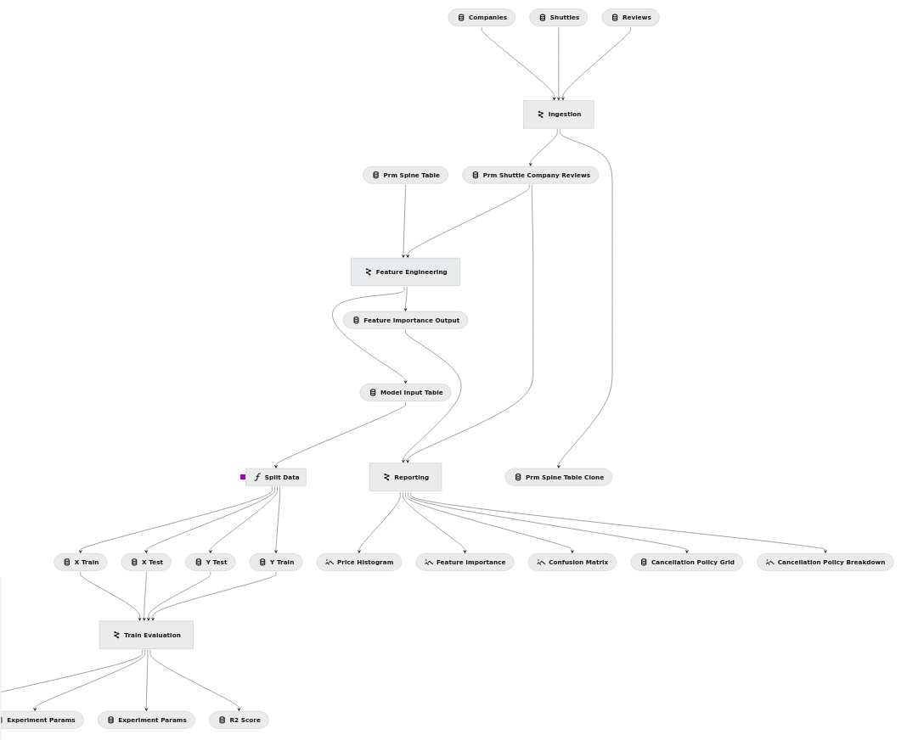

---
hide:
  - navigation
  - toc
---

<header class="landing">
<h1 class="tagline">Blazing fast spacecraft navigation</h1>
</header>

<main class="landing">
    
<section class="grid">
    <article>
        <h2>Title 1</h2>
        

        

            

                
Nyx

                
90%

            

            

                
GMAT

                
50%

            

            

                
ANSYS

                
30%

            

            

        

    </article>

    <article>
        <h2>Title 2</h2>
        

        
        

    </article>

    <article>
        <h2>Title 3</h2>
        
Content 3

    </article>

    <article>
        <h2>Title 4</h2>
        
Content 4

    </article>
</section>
    
</main>

