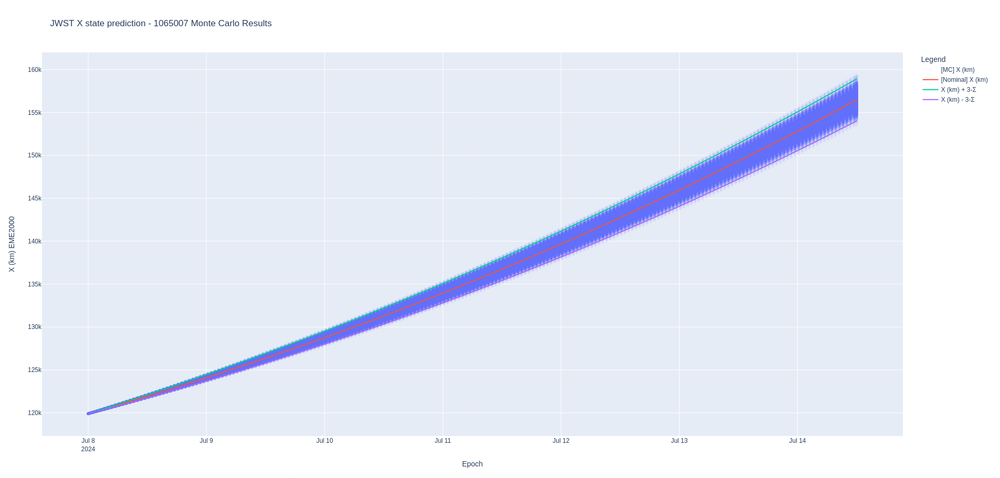
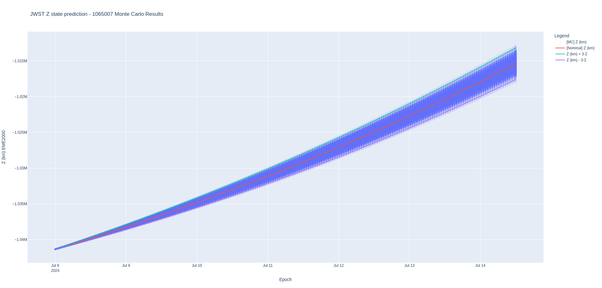
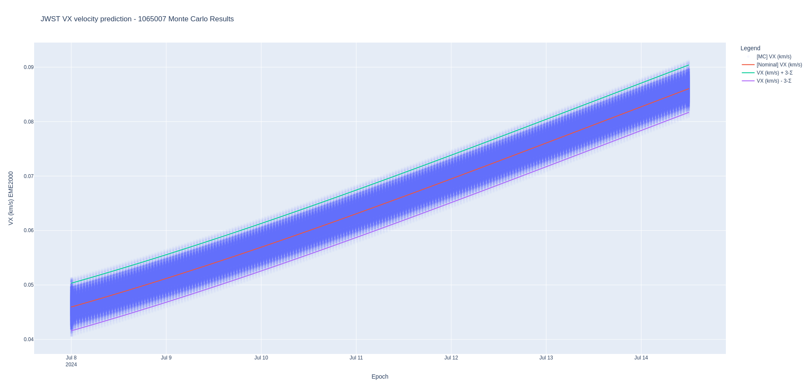
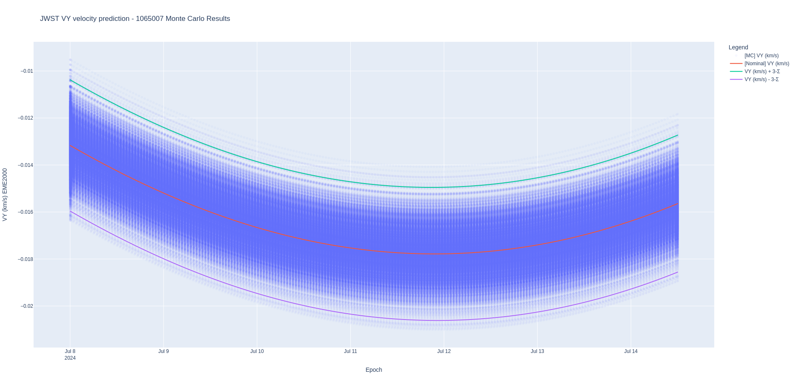
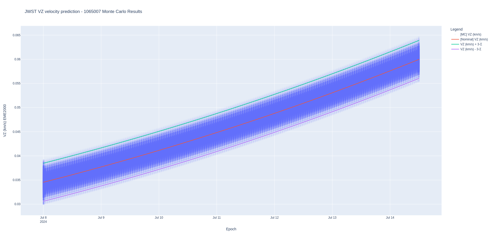
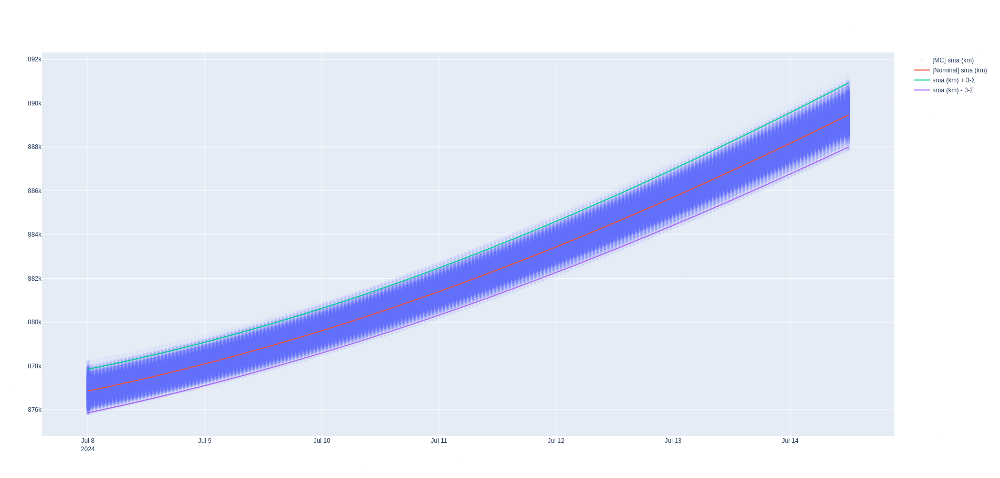
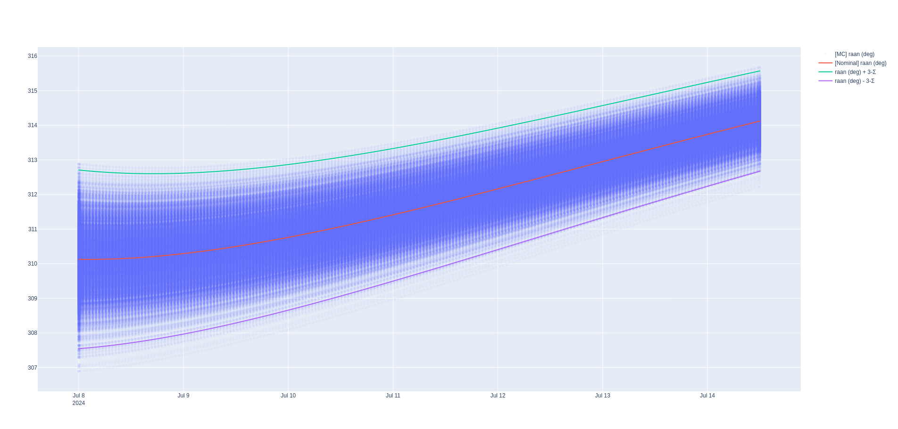
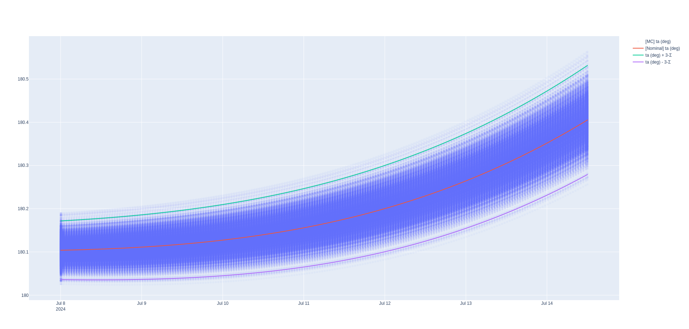

# James Webb Space Telescope covariance Monte Carlo

Spaceflight dynamics requires a lot of statistical analysis to convince ourselves that the results we'll present to all other teams are correct.

In this example, you'll learn how to sample the orbital state from SPICE BSP file (the industry standard for ephemeris information) and build a spacecraft structure around that orbit. Then, we'll build an uncertainty in the position and velocity of that spacecraft, and propagate it into the future.

To run this example, just execute:
```sh
RUST_LOG=info cargo run --example 02_jwst --release
```

Building in `release` mode will make the computation significantly faster. Specifying `RUST_LOG=info` will allow you to see all of the information messages happening in ANISE and Nyx throughout the execution of the program.

## Objective

We aim to compare two different statistical methods in order to demonstrate two advanced features of Nyx.

First, we'll use a _covariance mapping_ approach, whereby the covariance at some time `t0` is propagated to a future time `t1` along with the spacecraft trajectory. This is commonly used for the _time update_ or _prediction_ step of an orbit determination process.

Then, we'll use the Monte Carlo framework of Nyx to propagate the initial spacecraft state after dispersions using all threads of the computer. Multi-threaded propagation is not common in other astrodynamics software.

Finally, we'll check that the 3-sigma (i.e. 99.7%) covariance bounds of the covariance mapping approach matches the Monte Carlo results in terms of uncertainty in the state vector and in the Keplerian orbital elements.

## Example run

Nyx is **_blazing fast_**. The covariance mapping and the Monte Carlo runs of 5000 runs is executed in less than one minute. Then it takes about 41 seconds to export all of the trajectory data into a ~246 MB parquet file.

```sh
Compiling nyx-space v2.0.0-rc (/home/crabotin/Workspace/nyx-space/nyx)
 Finished `release` profile [optimized] target(s) in 3.52s
  Running `target/release/examples/02_jwst`
INFO  anise::almanac::metaload::metafile > Saved https://naif.jpl.nasa.gov/pub/naif/JWST/kernels/spk/jwst_rec.bsp to /home/crabotin/.local/share/nyx-space/anise/jwst_rec.bsp (CRC32 = a8460057)
INFO  anise::almanac::metaload::metafile > Using cached /home/crabotin/.local/share/nyx-space/anise/de440s.bsp
INFO  anise::almanac::metaload::metafile > Using cached /home/crabotin/.local/share/nyx-space/anise/pck11.pca
INFO  anise::almanac::metaload::metafile > Discarding cached /home/crabotin/.local/share/nyx-space/anise/moon_fk.epa - CRC32 differ (got 194230817, config expected 292928914)
INFO  anise::almanac::metaload::metafile > Saved http://public-data.nyxspace.com/anise/v0.4/moon_fk.epa to /home/crabotin/.local/share/nyx-space/anise/moon_fk.epa (CRC32 = b93ba21)
INFO  anise::almanac::metaload::metafile > Discarding cached /home/crabotin/.local/share/nyx-space/anise/moon_pa_de440_200625.bpc - CRC32 differ (got 3454388861, config expected 1817759242)
INFO  anise::almanac::metaload::metafile > Saved http://public-data.nyxspace.com/anise/moon_pa_de440_200625.bpc to /home/crabotin/.local/share/nyx-space/anise/moon_pa_de440_200625.bpc (CRC32 = cde5ca7d)
INFO  anise::almanac::metaload::metafile > Saved https://naif.jpl.nasa.gov/pub/naif/generic_kernels/pck/earth_latest_high_prec.bpc to /home/crabotin/.local/share/nyx-space/anise/earth_latest_high_prec.bpc (CRC32 = a74b6afd)
INFO  anise::almanac                     > Loading almanac from /home/crabotin/.local/share/nyx-space/anise/de440s.bsp
INFO  anise::almanac                     > Loading as DAF/SPK
INFO  anise::almanac                     > Loading almanac from /home/crabotin/.local/share/nyx-space/anise/pck11.pca
INFO  anise::almanac                     > Loading almanac from /home/crabotin/.local/share/nyx-space/anise/moon_fk.epa
INFO  anise::almanac                     > Loading almanac from /home/crabotin/.local/share/nyx-space/anise/moon_pa_de440_200625.bpc
INFO  anise::almanac                     > Loading as DAF/PCK
INFO  anise::almanac                     > Loading almanac from /home/crabotin/.local/share/nyx-space/anise/earth_latest_high_prec.bpc
INFO  anise::almanac                     > Loading as DAF/PCK
INFO  anise::almanac                     > Loading almanac from /home/crabotin/.local/share/nyx-space/anise/jwst_rec.bsp
INFO  anise::almanac                     > Loading as DAF/SPK
JWST defined from 2024-04-13T22:40:09.185630849 ET to 2024-07-08T00:01:09.183912447 ET
[Earth J2000] 2024-07-08T00:01:09.183912447 ET	sma = 876856.027357 km	ecc = 0.985029	inc = 52.340344 deg	raan = 310.126394 deg	aop = 130.798599 deg	ta = 180.103906 deg
total mass = 6200.000 kg @  [Earth J2000] 2024-07-08T00:01:09.183912447 ET	position = [119901.070276, -1389299.665421, -1041369.150539] km	velocity = [0.045956, -0.013168, 0.034535] km/s  Coast
RIC  σ_x = 0.5 km  σ_y = 0.3 km  σ_z = 1.5 km
RIC  σ_vx = 0.0001 km/s  σ_vy = 0.0006 km/s  σ_vz = 0.003 km/s
σ_cr = 0  σ_cd = 0  σ_mass = 0 kg

INFO  nyx_space::od::process             > Mapping covariance for 6 days 12 h with 1 min step
INFO  nyx_space::od::process::export     > Exporting orbit determination result to parquet file...
INFO  nyx_space::od::process::export     > Serialized 9360 estimates and residuals
INFO  nyx_space::od::process::export     > Orbit determination results written to ./02_jwst_covar_map.parquet in 734 ms 125 μs 312 ns
INFO  nyx_space::mc::montecarlo          > Propagated 5000 states in 58 s 792 ms 823 μs 694 ns
INFO  nyx_space::mc::results             > Exporting Monte Carlo results to parquet file...
INFO  nyx_space::mc::results             > Serialized 1065006 states from 2024-06-24T00:01:09.184303103 ET to 2024-06-30T12:01:09.184303103 ET
INFO  nyx_space::mc::results             > Evaluating 2 event(s)
INFO  nyx_space::mc::results             > Trajectory written to 02_jwst_monte_carlo.parquet in 41 s 603 ms 696 μs 128 ns
```

## Analysis

Overall, we can confirm that the 3-sigma covariance is a good approximation of the uncertainty. Notably, all of the dispersed trajectories fit (nearly) within the 3-σ bounds in the state space and in the Keplerian orbital element space. The rotation from the Keplerian orbital element space into the Cartesian space is done by building the Jacobian from the desired Keplerian elements into the Cartesian space using hyperdual numbers (also called "automatic differentiation" in the machine learning world). This ensure that we don't lose any precision in the state space change, and that's shown to be the case in these plots.

### State uncertainties

As expected from any orbit determination software, Nyx can output uncertainties in the state vector in the integration frame and in the RIC frame. **Note:** these plots look pretty linear, but that's because we're running a pure prediction filter and JWST is in a stable halo orbit.













### Keplerian uncertainties

A few tools try to provide Keplerian uncertainties, but often fail to do so correctly (<small>I'm looking at you, ODTK</small>). Nyx rotates the covariance from its Cartesian form into the Keplerian state space by computing the partial derivatives of each requested parameter with respect to the nominal state. This computation is flawless because it uses automatic differentiation (via _hyperdual numbers_). As such, the OD export also includes all of the state computations supported in Nyx, including uncommon ones like the uncertainties in the energy of the orbit or in the true anomaly.

The following columns are also provided as 1-sigma in the OD dataframe:
- Sigma aol (deg)
- Sigma c3 (km^2/s^2)
- Sigma declin (deg)
- Sigma ea (deg)
- Sigma fpa (deg)
- Sigma hmag (km)
- Sigma hx (km)
- Sigma hy (km)
- Sigma hz (km)
- Sigma ma (deg)
- Sigma right_asc (deg)
- Sigma rmag (km)
- Sigma semi_parameter (km)
- Sigma semi_minor (km)
- Sigma tlong (deg)
- Sigma vmag (km/s)
- Sigma Cr (Earth J2000) (unitless)
- Sigma Cd (Earth J2000) (unitless)
- Sigma Mass (Earth J2000) (kg)








