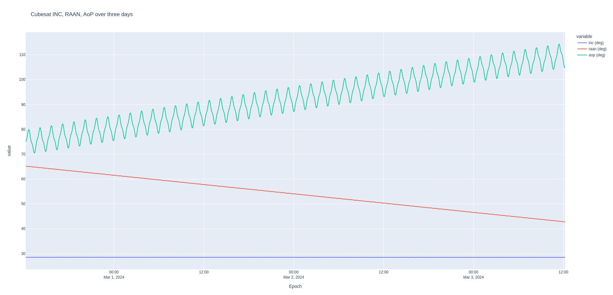
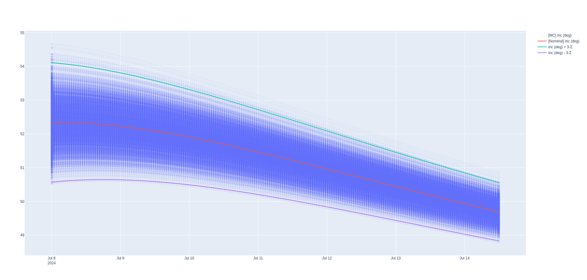
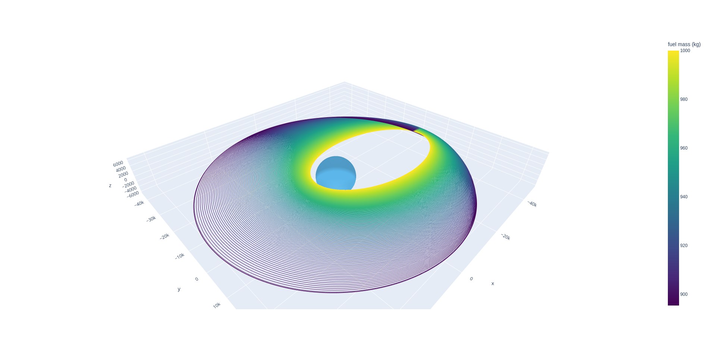
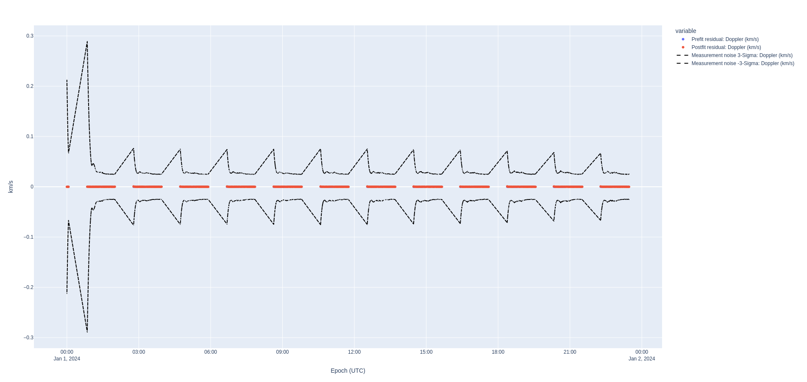

Nyx provides flight dynamics engineers with a set of powerful, open-source tools for mission design and orbit determination. From trajectory optimization to orbit estimation, Nyx is built for speed, automation, and scalability.

This section showcases some of the problems that you can solve with the whole suite of tools of Nyx.

-   :material-axis-z-rotate-clockwise:{ .lg .middle } __Exporting High Fidelity Orbit Propagation to CCSDS OEM__

    ---

    _HPOP_ of an Earth centered spacecraft, exporting the OEM, and computing passes from Colorado, USA.

    

    [:octicons-arrow-right-24: Read more](./01_orbit_prop/index.md)
    
    [:material-code-tags: Source code](https://github.com/nyx-space/nyx/tree/master/examples/01_orbit_prop)

-   :material-telescope:{ .lg .middle } __James Webb Space Telescope Monte Carlo Simulation__

    ---

    Blazing fast multithreaded Monte Carlo simulation of the JWST orbit, and comparison with an orbit determination prediction

    

    [:octicons-arrow-right-24: Read more](./02_jwst_covar_monte_carlo/index.md)
    
    [:material-code-tags: Source code](https://github.com/nyx-space/nyx/tree/master/examples/02_jwst_covar_monte_carlo)

-   :material-satellite-variant:{ .lg .middle } __GEO Low Thrust Orbit Raising & StationKeeping__

    ---

    GEO eclipse analysis, orbit raising when sunlit, and station keeping, in high fidelity dynamics

    

    [:octicons-arrow-right-24: Read more](./03_geo_analysis/index.md)
    
    [:material-code-tags: Source code](https://github.com/nyx-space/nyx/tree/master/examples/03_geo_analysis)

-   :material-motion:{ .lg .middle } __Lunar Reconnaissance Orbiter Orbit Determination__

    ---

    Orbit determination of the _as-flown_ LRO spacecraft using NASA Goddard's published definitive ephemeris

    

    [:octicons-arrow-right-24: Read more](./04_lro_od/index.md)
    
    [:material-code-tags: Source code](https://github.com/nyx-space/nyx/tree/master/examples/04_lro_od)

--8<-- "includes/Abbreviations.md"